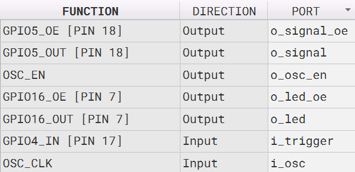
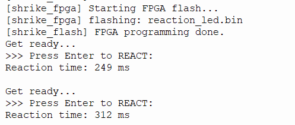

# LED Reaction Timer

**Difficulty:** Beginner  
**Uses MCU:** Yes  
**External Hardware:** None

## Overview

A reaction-time trainer that lights an LED after a pseudo-random delay of 0 to N seconds.
Press Enter on your terminal the moment the LED fires and your reaction time is printed in milliseconds.
Uses PRNG seeding using lfsr and counters.
No other external hardware is used other than the onboard led.

> **Note:** This is a PRNG (Pseudo-Random Number Generator) based design.

## Compatibility

| Board | Firmware | Status |
|-------|----------|--------|
| Shrike-Lite (RP2040) | `firmware/micropython/` | ✅ Tested |
| Shrike (RP2350) | `firmware/arduino-ide/` | ⬜ Untested |
| Shrike-fi (ESP32-S3) | `firmware/arduino-ide/` | ⬜ Untested |

> FPGA bitstream is the same across all boards.

## Hardware Setup


**No external hardware required. Uses the on-board LED**


## Quick Start (Pre-Built Bitstream)

1. Connect your Shrike board via USB
2. Upload `bitstream/led_reaction_timer.bin` using ShrikeFlash
3. Expected result: Watch the onboard LED and press Enter the moment the LED lights up. The terminal prints your reaction time in milliseconds.

## Build From Source

### FPGA (Verilog)
1. Open `lfsr.ffpga` in Go Configure Software Hub (GCSH)
2. Synthesize → Generate Bitstream
3. Output `.bin` will appear in `ffpga/build/` 

## How It Works

- The FPGA runs a **32-bit free-running counter** that increments every clock cycle.
- On a rising edge from the MCU trigger pin, the counter value seeds a **32-bit LFSR** (taps: 31, 21, 1, 0).
> An LFSR work by shifting bits down a line, taking specific bit positions (called taps), XORing them together, and giving feedback to the first bit
- When `i_trigger` is pressed, a rising-edge detector captures the counter's exact state.
- The LFSR output modulo 275,000,000 gives a pseudo-random delay in the range **0–5.5 seconds**.
- The MCU pulses the trigger pin to start each round, waits for the LED signal pin to go high, then timestamps the user's Enter keypress and prints the reaction time in milliseconds.  
- To change the maximum random delay interval from 0 to N *(max ~10s for current RTL)*, you need to modify the modulo threshold value in the RTL. The value is calculated based on your clock frequency using this formula:

Value = Desired Max Delay (seconds) × Clock Frequency (Hz)

- Example: 0 to 3-second interval on the 50MHz clock
1. **Calculate the cycles:** 3 seconds × 50,000,000 Hz = 150,000,000 clock cycles.
2. **Update the RTL:** Since 150,000,000 easily fits inside the 29-bit limit, you change the threshold value directly in the code:

```verilog
// Change 275_000_000 to 150_000_000
r_delay <= r_lfsr[28:0] % 29'd150_000_000;
```

## Expected Output

```bash
Get ready...

Press Enter to REACT:

Reaction time: 312 ms
```
Thonny Shell:



